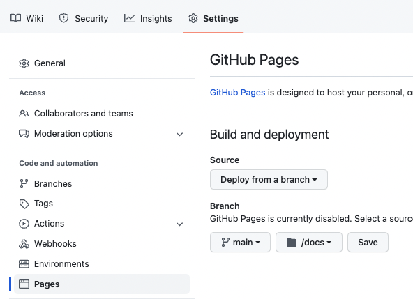

= template-asciidoctor-dockerized

Génération de slides, pdf, ebook, docx à l'aide de Asciidoctor et docker compose.

Ce dépôt a été généré à partir du template : https://github.com/baldir-fr/template-asciidoctor-dockerized

== Documents générés

* link:docs/index.html[Slides générées]
* link:docs/output.pdf[Pdf]
* link:docs/output.epub[Ebook]
* link:docs/output.docbook.xml[Docbook]
* link:docs/output.docx[Docx]

== Comment écrire du contenu

Modifier les fichiers présents dans `01-slides`

== Pré-requis pour construire les exemples

* Docker Engine 19.03.0+
* Docker compose

Optionnel

* GNU Make

== Génération des slides

[source,shell]
----
docker compose run build-slides
# Ou avec GNU Make
make 01-slides
----

== Génération du Pdf

[source,shell]
----
docker compose run --rm build-slides; rm -rf docs/assets;cp -r 01-slides/assets docs/
# Ou avec GNU Make
make 01-pdf
----

== Génération du E-book

[source,shell]
----
docker compose run build-epub
# Ou avec GNU Make
make 01-epub
----

[#_generation_du_docbook]
== Génération du docbook

[source,shell]
----
docker compose run build-docbook
# Ou avec GNU Make
make 01-docbook
----

== Génération docx

Prérequis : avoir pandoc installé (je n'ai pas encore réussi à le faire fonctionner avec docker)

Après avoir <<_generation_du_docbook,généré le docbook>>

[source,shell]
----
pandoc --from docbook \
  --to docx \
  --toc \
  --highlight-style tango \
  -o docs/output.docx \
  --resource-path=docs \
  docs/output.docbook.xml
----

== Paramétrage de Github Pages

* Dans le menu "Settings" de Github.
** Section "Pages"
*** Build and deployment
**** Source : Deploy from branch
**** Branch : `main`, `/docs`

== Ressource complémentaires

* https://github.com/asciidoctor/docker-asciidoctor/blob/main/README.adoc[docker-asciidoctor]
* https://docs.asciidoctor.org/asciidoctor/latest/cli/:[Asciidoc CLI]
* https://docs.asciidoctor.org/reveal.js-converter/latest/converter/features/[Asciidoctor revealjs — écrire une présentation]
* https://docs.asciidoctor.org/reveal.js-converter/latest/converter/revealjs-options/[Asciidoctor revealjs — configurer revealjs]
* https://docs.asciidoctor.org/asciidoc/latest/directives/include-tagged-regions/#tagging-regions[Asciidoctor — inclure des snippets à l'aide de régions]
* https://docs.asciidoctor.org/asciidoc/latest/directives/ifdef-ifndef/[Asciidoc — Conditionals / ifdef and ifndef Directives]
* https://mrduguo.github.io/asciidoctor.org/docs/asciidoctor-revealjs/#content-meant-for-multiple-back-ends[Asciidoctor-revealjs — Content meant for multiple back-ends]

